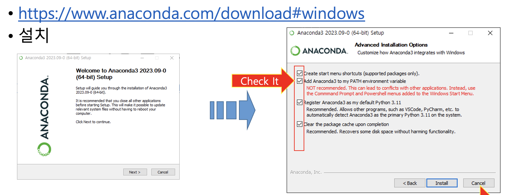
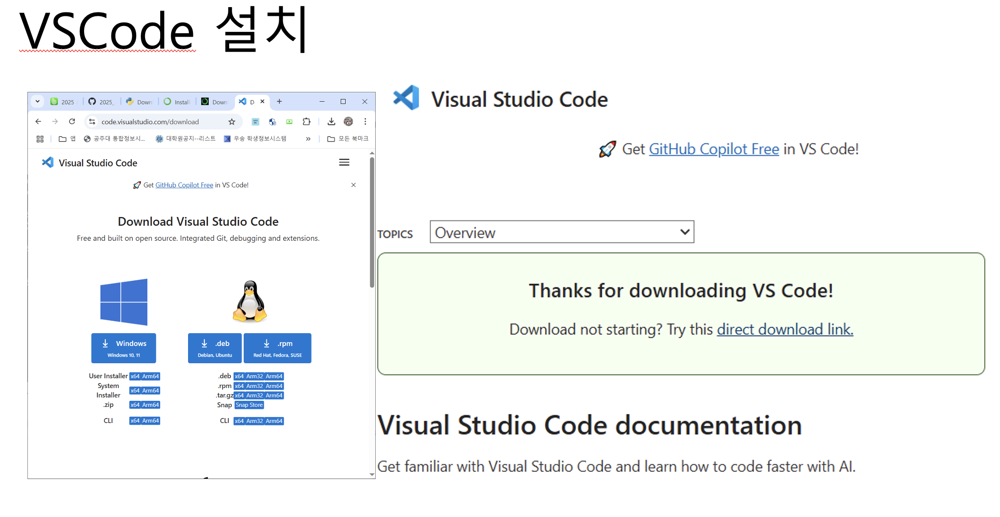
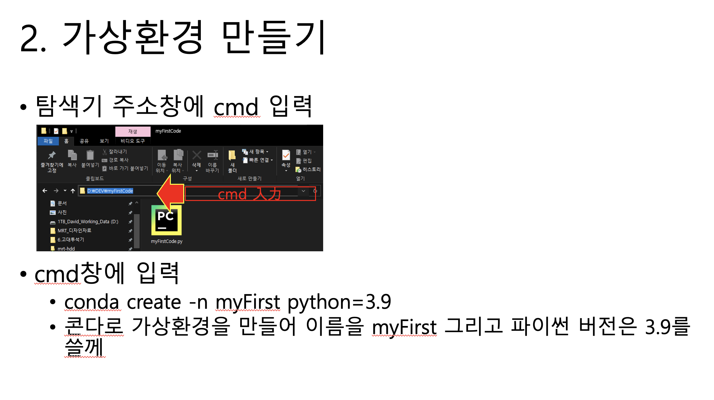
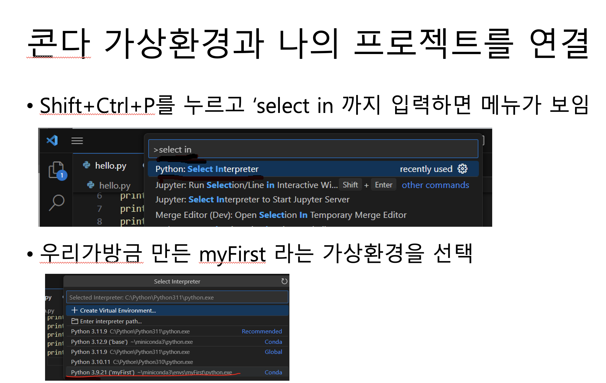
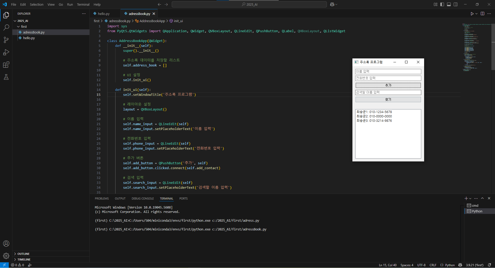

# installationPython
파이썬 개발 환경 구축

## Miniconda를 이용해 가상환경을 구축해보자

### 파이썬 개발 환경은 여러가지 방법이 있다. 
### 이번 강의에서는 Miniconda과 VScode를 이용해 가상환경을 구축해 python 개발환경을 만들어 보았다.

### 필요 프로그램 다운
1. anaconda 또는 Miniconda를 이용해서 python interpreter를 설치했다. 
2. VScode를 설치했다. 

### 파이썬 가상환경 만들기
3. 가상환경 생성 
4. 가상환경과 VScode를 연결 

### 결과물 확인
5. chatGPT에게 물어본 코드를 VScode 가상환경에서 실행시켰다. 

